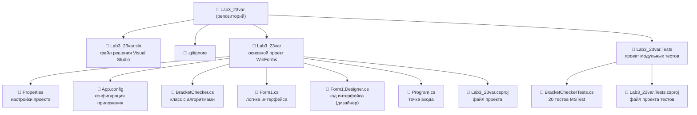

# Лабораторная работа 3. Вариант 23

# Информация о студенте

- **ФИО:** Пестов Михаил Александрович
- **Группа:** Б.ПИН.ИИ.25.16
- **Вариант:** 23

# Тема работы

Алгоритмы и анализ сложности. Проверка правильности скобочной последовательности.

# Цель работы

Изучить классические алгоритмы, освоить методы анализа временной сложности, приобрести навыки разработки приложений с графическим интерфейсом и модульного тестирования.

# Задачи лабораторной работы

1. Реализовать два алгоритма проверки скобочной последовательности без использования встроенных функций.
2. Разработать графический интерфейс Windows Forms для ввода данных и отображения результатов.
3. Измерить время выполнения каждого алгоритма с использованием класса Stopwatch.
4. Подсчитать количество элементарных операций для каждого алгоритма.
5. Визуализировать результаты сравнения в виде таблицы.
6. Разработать модульные тесты с использованием MSTest.

# Постановка задачи (Вариант 23)

## Алгоритм 1. Проверка с использованием стека

Обход строки посимвольно: открывающие скобки помещаются в стек, при встрече закрывающей — извлекается верхний элемент и проверяется соответствие типов. Поддерживает `()`, `[]`, `{}`.

## Алгоритм 2. Проверка с использованием счётчика

Целочисленный счётчик увеличивается при `(` и уменьшается при `)`. Если счётчик уходит в минус — последовательность некорректна. Работает только с круглыми скобками `()`.

# Анализ сложности

| Характеристика             | Стек   | Счётчик |
|----------------------------|--------|---------|
| Временная сложность        | O(n)   | O(n)    |
| Пространственная сложность | O(n)   | O(1)    |
| Поддержка типов скобок     | (), [], {} | только () |

# Особенности реализации

- Алгоритмы вынесены в отдельный статический класс `BracketChecker`
- Каждый метод возвращает счётчик элементарных операций через `out long ops`
- Замер времени через `System.Diagnostics.Stopwatch`
- Кнопка «Тест производительности» автоматически прогоняет оба алгоритма на строках размером 100, 500, 1000, 2000, 5000, 10000 символов
- Результаты отображаются в `DataGridView`

# Структура репозитория

---

# Технологический стек

- **Язык программирования:** C# 7.3
- **Платформа:** .NET Framework 4.7.2
- **Тип приложения:** Windows Forms (WinForms)
- **Тестирование:** MSTest (Unit Test Project)
- **Среда разработки:** Visual Studio 2022
